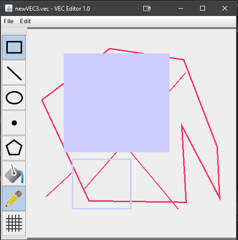
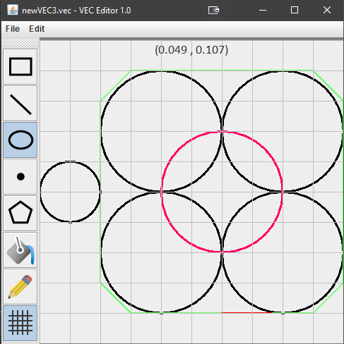
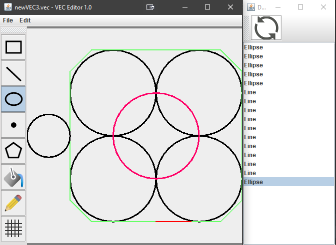

# Vector-Shapes
Vector-Shapes is a legacy MS-Paint like program written in Java that uses a psuedo language to draw shapes with vector inputs onto a cartesian 2D canvas. This tool was created with the Java Swing and AWT frameworks to allow for cross-platform compatibility and was created for an assessment piece in CAB302.

## Features
- File Saving and custom `VEC` file format
- Ability to draw dots, line, circle, squares and polygons of *x* vertices
- Export a canvas to a BMP formatted image
- In-built colour picker with outline and fill support
- Grid support for drawing precise shapes with snapping and customisable grid spacing
- Undo and Undo History support

## Functionality
The vec file format works as follows:
1. A Shape is specified which will be drawn
2. The vertices (corners) are specified on the same line
3. A PEN or FILL command can be issued to change the shape's outline or inner fill colours
4. This can be repeated for any amount of times to create exotic and interesting canvases

A Sample Vec File is shown below:
```
RECT 0.5 0.5 0.75 0.75
RECT 0.1 0.2 0.3 0.4
PLOT 0.1 0.2
PLOT 0.8 0.8
FILL #00ff00
PLOT 0.923 0.933
PEN #ff3300
FILL #000000
RECT 0.622 0.633 0.74 0.712
LINE 0.15 0.15 0.35 0.35
FILL #e242f4
POLYGON 0.5 0.2 0.75 0.3 0.65 0.6 0.35 0.6 0.23 0.3
```

## Screen Captures




## Authors
[@benjaminbrewerton](https://github.com/benjaminbrewerton)
[@phoebelestrange99](https://github.com/phoebelestrange99)
[@g4brie11e](https://github.com/g4brie11e)

## Disclaimer
Unfortunately since this was developed for a university assignment, I cannot release the source code. However, if anyone is privately interested, please feel free to contact me at benbrewerton98@gmail.com
